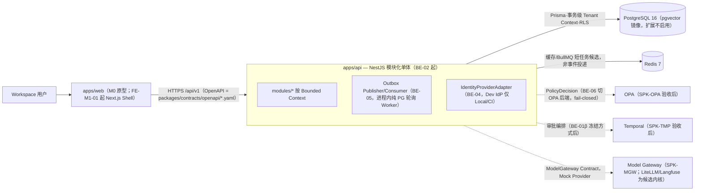

# Dev-Ready Package：EPIC-FOUNDATION（M1 Foundation）— Production Dev-Ready（阶段一 BE-01α 正文 + 阶段二 BE-01β 占位）

> **交付要求 #12：M1 生产实现开始前必须提交并通过本包评审。** 本文档为 **BE-01α（阶段一）组装稿**：五个不依赖 Spike 的段已按 11 段模板编排为正文；BE-01β 段落以占位登记（见文末待办）。
> **启动门（GDR-002 修订，2026-07-04）**：本包分两阶段——**阶段一（BE-01α，不依赖 Spike 的段）经业务负责人 R2 批准后，即可启动 Foundation 地基运行时编码（BE-02..05）**；阶段二（BE-01β：Permissions/Temporal/Model Gateway/任务分解段）随 Spike 验收卡终审，最晚 BE-04 开始前完成；纵向切片（BE-09）需 BE-01β 完成。原「未过 Gate 3 不启动 M1 Runtime 编码」表述由本条取代（docs/program/M1_BACKEND_FOUNDATION_PLAN.md）。

- **Release / Wave：** M1 / Wave 1
- **覆盖需求：** WSP-001~010（部分）、母本第 11 部分架构、ADR-001~018 + ADR-100~104
- **依赖 Open Decision：** OD-11（代理商模式影响 Workspace Schema，批示：不阻塞 BE-03）、OD-13（审批默认集，🔶 部分已决，统一口径见 §6.6）、OD-14（生产 IdP，最晚 M1 外部 Alpha 前）
- **依赖 Spike：** Temporal / OPA / LiteLLM / Langfuse（docs/oss/，W1）——**Spike 结果决定 BE-01β 段落，α 段不依赖 Spike**

## 11 段状态表（BE-01α 组装后）

| 段 | 内容 | 状态 |
|---|---|---|
| 1 Product Requirements | 多租户平台地基、Workspace/权限/审批/预算/审计 | ✅ 母本 7.1 已定（本包只作指针，不复写） |
| 2 User Flow | 建组织→Workspace→成员→角色→策略 | ✅ BE-01α 冻结 |
| 3 UI States | 设置页/权限/审批八态 | ✅ BE-01α 冻结（α 不实施 UI，冻结的是后端可判定信号矩阵） |
| 4 Domain Model | Core ERD（Prisma）+ Tenant Scope + RLS + PII 分级 | ✅ BE-01α 冻结 |
| 5 API/Event | /workspaces 组 OpenAPI + workspace.events → NestJS 实现 | ✅ BE-01α 冻结（BE-02/BE-05 执行规格） |
| 6 Permissions | RBAC+ABAC 矩阵、Policy 动作、审批链、审计事件 | 🔄 BE-01β：α 已冻结认证/RBAC/Claims/Session 模型（§6.1–6.5）；OPA 矩阵执行细则与 fail-closed 动作清单待 SPK-OPA 验收卡（逐段引用验收卡编号后才冻结） |
| 7 Tests | 租户隔离测试、RLS 测试、权限矩阵测试、契约测试 | ✅ BE-01α 冻结 |
| 8 AI Eval | N/A（Foundation 无 AI Task） | N/A |
| 9 Threat Model | 多租户泄漏（RISK-009）、Secret、认证、越权、SSRF | ✅ BE-01α 冻结（STRIDE 精简版；正式版按 docs/security/THREAT_MODEL.md 骨架补数据流图与信任边界） |
| 10 Rollout/Rollback | 迁移可回滚、Feature Flag、灰度 | ✅ BE-01α 冻结（迁移/回滚/种子已冻结；Feature Flag M1 简化口径见 §10 第 7 条，百分比灰度/发布策略 M2 前显式后置） |
| 11 Task Breakdown | Adapter Framework / Tenant / RBAC / Outbox / Policy / Approval 拆 PR | 🔄 BE-01β 终审：α 已冻结 BE-02..05 四件套（§11）；BE-06、BE-09A..E 细化待 SPK-OPA/SPK-TMP/SPK-MGW 三卡后终审 |

Temporal 编排段与 Model Gateway 段不属 11 段模板固有段，作为 BE-01β 附加段登记于文末「BE-01β 待办」。

## 0. 架构基线（BE-01α 冻结）：C4 Container / Bounded Context / 部署拓扑与环境阶梯

> 本段冻结 BE-02..05 开工所需的容器边界、模块划分与环境承载矩阵，支撑段 4/5/10/11。权威指针：母本 11.1/11.4/11.5、`docs/architecture/`（bounded-contexts.md、deployment-topology.md、event-architecture.md、integration-boundaries.md、data-ownership.md）、ADR-100~104。C1/C2 权威图在母本，本段按 `docs/architecture/C4/README.md` 约定以 mermaid 重绘 M1 目标态。

### 0.1 C4 Container 图（M1 目标态）



| Container | 技术 | 引入点 | M1 边界（与 DoD 呼应） |
|---|---|---|---|
| apps/api | NestJS 模块化单体（ADR-100） | BE-02 | health/readiness、/api/v1、request-id+correlation-id、统一错误体（对齐 contracts 错误模型）、OTel 骨架、Config 校验拒占位密钥、优雅停机；BE-02 不含业务 |
| PostgreSQL | pgvector/pg16 镜像（infra/docker-compose.dev.yml） | 已有 | 唯一业务事实源（ADR-101/D-011）；RLS+FORCE、fail-closed GUC（BE-03 硬口径）；**pgvector 扩展不启用，留待 W2 知识层 Bake-off（OD-09）** |
| Redis | redis:7-alpine | 已有 | 仅缓存/BullMQ 短任务候选（母本 ADR-002 分工）；**不承担 Outbox 投递语义**（BE-05：不变相引入第二 broker） |
| Outbox Pub/Sub | apps/api 进程内轮询 Worker | BE-05 | envelope 严格按 `packages/contracts/json-schema/common/envelope.schema.json`（event_id/schema_version/workspace_id/correlation_id/causation_id；无 idempotency_key，去重靠 event_id+consumer checkpoint）；DLQ 深度进 readiness |
| OPA | 独立容器 | BE-06（依赖 SPK-OPA+BE-01β） | 仅覆盖 PolicyDecision 清单动作；不可用→清单动作全拒+readiness 亮红 |
| Temporal / Model Gateway | Spike 阶段 | BE-01β 终审后 | Spike 批准 ≠ 生产采用（§5-F：License/Security Review + Production Gate 后才升级） |

### 0.2 apps/api 首批 NestJS 模块划分（BE-02 冻结目录骨架）

```text
apps/api/src/
  main.ts · app.module.ts
  common/           # 无业务横切：错误体/异常过滤器、ValidationPipe、request-id+correlation-id 拦截器、
                    #   Idempotency-Key 处理、分页/DTO 基类 —— 只依赖 contracts 类型，禁依赖下两层
  infrastructure/   # PrismaService（事务级 Tenant Context：SET LOCAL GUC，池归还前清理）、outbox/、
                    #   audit/（AuditContext）、config/（启动校验）、otel/、health/（含 DLQ 深度）
  modules/          # 按 Bounded Context 一 Context 一模块
    workspace/      #   含 identity 子模块：IdentityProviderAdapter、Session/JWT、Membership、RBAC、
                    #   PolicyDecision 接口（BE-04 先内置规则，BE-06 切 OPA）
    knowledge/  lead/  campaign/  opportunity/   # BE-09A..D 逐个启用，此前仅空目录+README
```

- 与 PR 映射：BE-02 = common + infrastructure（不含 persistence 业务表）+ health；BE-03 = infrastructure/persistence + prisma/（Organization/User 平台级无 workspace_id，Workspace/Membership/Role/AuditLogEntry/FeatureFlag/Budget（含配额维度——裁决 #2）/IdempotencyRecord（裁决 #6）按 BE-03 表集所有权）；BE-04 = modules/workspace/identity + 认证域与策略实体迁移（UserIdentity（裁决 #3）、PermissionGrant/WorkspacePolicy/ApprovalRule/ControlSwitch，契约见 `packages/contracts/json-schema/workspace/*.schema.json`）；BE-05 = infrastructure/outbox。
- 领域逻辑归宿是 `packages/domain-*`（bounded-contexts.md 既定）；M1 允许先内联于 `modules/<ctx>/domain/`，出现第二消费方（Python Worker/第二 app）时抽包，抽包不得改契约（本条属 BE-01α 冻结项）。

### 0.3 Bounded Context 所有权与禁依赖方向

| Context（docs/architecture/bounded-contexts.md） | 契约 | apps/api 模块 | M1 所有权要点 |
|---|---|---|---|
| Workspace/Identity | contracts/workspace | modules/workspace | 租户边界；Organization/User 为平台级实体（无 workspace_id，BE-03）；OD-11 只做通用 Organization→Workspace→Membership，代理商语义不实现 |
| Company/Knowledge | contracts/knowledge | modules/knowledge | Claim/Evidence 事实源在 PG（D-013）；Brand 持久化随 BE-09A |
| ICP/Lead | contracts/lead | modules/lead | 六维评分骨架、Suppression 硬约束（BE-09B） |
| Campaign/Execution | contracts/campaign | modules/campaign | Campaign=上下文非聚合根（D-009）；授权即冻结快照（BE-09C） |
| Engage/Opportunity | contracts/opportunity | modules/opportunity | SAO 必须由 Sales Acceptance 产生（BE-09D） |
| Market/Research · Data Hub · Content/Media · Analytics · Pack/Expert · AI/Ops | 待建 | M1 不建模块 | 按 bounded-contexts.md 时点引入，不预留空壳代码 |

**禁依赖规则（执行机制拆分——架构评审 #3）：规则 1–3 由 ESLint import 边界规则判定并进 CI（BE-02 起）；规则 4–5 属运行时约束，由运行时测试与评审承接，不由 ESLint 判定。**

1. 单向分层：`modules/* → infrastructure → common`；反向 import 即 CI 失败。（ESLint）
2. `modules/` 之间禁止 import 彼此内部——跨 Context 只允许「对方契约 DTO + ID 引用 + Outbox 事件」（母本 11.5：不共享 ORM 模型；campaign↔opportunity 仅 ID/事件关联，D-009）。（ESLint）
3. 任何层禁止 import 厂商/Provider/开源项目 SDK（integration-boundaries.md）；模型调用只经 ModelGateway Contract（ADR-007）。（ESLint——**厂商 SDK denylist 由 BE-02 的 eslint 配置维护，新增依赖走 lockfile 审查**）
4. 外部系统（AiToEarn/爬虫/媒体 Worker）不直连 PG（data-ownership.md、母本 11.4/ADR-013）；Python Worker 只经 JSON Schema 契约通信。（运行时测试/评审承接）
5. Tenant Context 仅可源自已验证 JWT 声明（BE-04 DoD），infrastructure 不提供测试注入路径。（运行时测试承接：BE-04 认证负向用例，§7.1）

### 0.4 环境阶梯（§5-D 拍板的工程化）

| 阶梯 | 建立时点 | 形态 | 承载的验证 | 明确不承载 |
|---|---|---|---|---|
| **Local** | 已有 | `docker compose -f infra/docker-compose.dev.yml up -d`（PG+Redis；BE-02 起端口改绑 127.0.0.1） | 开发内循环；BE-02 冒烟（本地起服务）；迁移 up/down 手动演练；DLQ replay 演示 | 任何验收证据（不可复现）；真实 Key（仅 gitignored env，SPK-MGW DoD） |
| **CI Ephemeral** | **即刻**（随 BE-02 的 workflow 变更，R2） | GitHub Actions service containers（postgres=同款 pgvector/pg16 镜像、redis:7）或 Testcontainers；每 run 全新实例 | verify 全链（ADR-104：lint/typecheck/test/contracts:validate）+ **BE-03 RLS 硬口径全部负向测试** + 迁移 up/down 双向 + BE-04 JWT 负向/权限矩阵 + BE-05 消费幂等/DLQ + BE-09E 生成客户端 E2E；作为 Required Check=verify 的唯一判定环境 | 长时运行观察；多人共享状态 |
| **Shared Dev/Staging** | **最晚 BE-09 开始前**（§5-D，显式后置不消失） | 单区域，云化前形态（单 VM/托管容器）随 M2 决策，不预设 IaC | 多会话联调；FE-M1-02 真实前端接真实 API；Outbox 轮询/DLQ 告警的长时稳定性；OTel 链路观测演练 | Dev Token/固定用户（BE-04 DoD 禁入 Staging+）；真实外呼（OD-06 未关闭） |
| **生产云** | **M2 前决策**（deployment-topology.md） | 目标态：Web/API + Growth Core + Temporal + 私有 Worker 子网 + Egress Allowlist；区域分级按 ADR-010 | 生产发布（R3，须人工批准）；Backup/RPO/RTO 与生产 CI/CD 随云化决策落地（已登记 ROADMAP 阻塞表） | —— |

**docker-compose 现状在阶梯中的角色**：`infra/docker-compose.dev.yml` 是 Local 与 CI Ephemeral 的同源依赖定义（同镜像版本，避免环境漂移）；pgvector 镜像仅为 Bake-off 预留、BE-03 不执行 `CREATE EXTENSION`；Temporal/OPA/MinIO 按 ADR-103「只起当前切片需要的依赖」原则按需追加——Spike 期间由 `spikes/**` 自带 compose 覆盖文件承载，**不改 infra/ 主文件、不写 packages/**（M1 计划 §2 Spike 产物边界）；OPA 服务在 BE-06 合入时才进入主 compose。

### 0.5 本段未决项（标注即止，不替业务负责人决策）

| 项 | 状态 | 对本段的影响 |
|---|---|---|
| OD-14 生产 IdP | ⬜ 开放（最晚 M1 外部 Alpha 前） | Container 图中 IdP 仅画 Adapter 接缝；Subject ID/Membership/Claims/Session 模型按 BE-01α 冻结，供应商可后换 |
| OD-11 代理商多 Workspace | ⬜ 开放（批示：不阻塞 BE-03） | 模块划分只含通用 Organization→Workspace→Membership；不出现代理商/跨客户委派组件 |
| OD-09 知识层选型（pgvector 退出基线） | ⬜ 开放（W2 Bake-off） | PG 容器不启用 pgvector 扩展；向量/检索容器不入 M1 拓扑 |
| 生产云架构（含 Backup/RPO/RTO、生产 CI/CD） | M2 前决策 | 阶梯第 4 级只列目标态与验证归属，不产 IaC |
| Temporal/OPA/LiteLLM/Langfuse 生产采用 | Spike 中（§5-F Gate） | 图中以虚线标注；接入顺序受 BE-01β 验收卡终审约束 |

## 1. Product Requirements

多租户平台地基：Workspace / 权限 / 审批 / 预算 / 审计（WSP-001~010 部分）。**产品需求正文以母本 7.1 为准，本包不复写**。范围 = BE-02..05 地基运行时；明确不做项（均为开放决策或显式后置，详见各段未决小节）：代理商多 Workspace 语义（OD-11）、生产 IdP 选型与 MFA/SSO 实现（OD-14）、真实外呼（OD-06）、pgvector/知识层选型（OD-09，W2 Bake-off）、生产云架构与 Backup/RPO/RTO（M2 前决策）。

## 2. User Flow（BE-02..05 覆盖：建组织→Workspace→成员→角色→策略）

端点均已存在于 `packages/contracts/openapi/workspace.yaml`；事件名以 `packages/contracts/asyncapi/workspace.events.yaml` 为准。认证前提：**Dev IdP 仅经 IdentityProviderAdapter、仅 Local/CI 启用（计划 §5-E）；生产 IdP 为 OD-14，未决，不在本包起草**。

**主流程（每步写操作带 `Idempotency-Key`，落 AuditLogEntry，BE-05 后经 Outbox 发事件）：**

| # | 步骤 | 端点 | 事件 | 归属 PR |
|---|---|---|---|---|
| 1 | Dev IdP 登录，签发 JWT（Subject/Claims 按本包 §6） | — | — | BE-04 |
| 2 | 建组织（组织级实体，无 workspace_id，BE-03 所有权规则） | `POST /organizations` | OrganizationCreated（**M1 发布显式后置**——平台级事件路径见 §5.6 处置注） | BE-03/04 |
| 3 | 建 Workspace，创建者自动获 OWNER Membership | `POST /workspaces` | WorkspaceCreated | BE-03/04 |
| 4 | 邀请成员：Membership `INVITED`→受邀者登录接受→`ACTIVE` | `POST /workspaces/{id}/memberships` | MembershipChanged | BE-04 |
| 5 | 改角色（枚举 OWNER/ADMIN/STRATEGIST/MARKETER/SALES/REVIEWER/EXPERT/VIEWER，`membership.schema.json`），带 `If-Match` | `PATCH …/memberships/{membership_id}` | MembershipChanged | BE-04 |
| 6 | 配置策略与审批规则（OD-13 🔶 部分已决：分类语义已定，统一口径见 §6.6 与 docs/program/OPEN_DECISIONS.md） | `POST …/policies`、`POST …/approval-rules` | PolicyUpdated / ApprovalRuleUpdated | BE-04（持久化）→ BE-06（OPA 执行，β 段） |
| 7 | 核查审计流水 | `GET …/audit-logs` | — | BE-04 |

**异常路径（逐条有确定性判定，错误体按 `packages/contracts/conventions.md` 统一模型）：**

| 场景 | 预期 |
|---|---|
| 同 `Idempotency-Key` 重放 | 返回首次结果，不重复创建（母本 11.16） |
| JWT 缺失/篡改/过期 | 401（过期 `TOKEN_EXPIRED`）；**Tenant Context 只源自已验证 JWT，无测试注入路径**（BE-04 DoD） |
| VIEWER 邀请成员/改策略 | 403 `ACTION_DENIED` + `policy_reason_codes` |
| 敏感策略变更命中审批集 | 403 `AUTHORIZATION_REQUIRED`，生成审批任务（WSP-006） |
| 用他租户 membership_id/workspace_id 访问 | **404**（跨租户 ID 枚举口径，BE-03 DoD） |
| 并发改角色 `If-Match` 过期 | 409 `VERSION_CONFLICT` + details 含当前 version/Diff |
| Workspace `SUSPENDED` 下写操作 | 拒绝，UI 对应 Blocked 态 |
| Membership `source=AGENCY_DELEGATION` | 仅 Schema 枚举保留；运行时不实现跨客户委派——**OD-11 开放，命中即停** |

## 3. UI States（M1 设置/权限/审批页 八态）

- 八态取值与 M0 治理组件 `apps/prototype/src/components/governance/PageState.tsx` 完全一致：`EMPTY / LOADING / ERROR / PERMISSION / PARTIAL_SUCCESS / NEEDS_REVIEW / NEEDS_ACTION / BLOCKED`（母本 6.10、`docs/epics/_TEMPLATE.md` 第 3 段）。
- **复用原则（RISK-103）**：M1 生产 Web（FE-M1-01 Next.js）**复用 M0 治理组件形态与设计令牌**（PageState/ApprovalCard/EvidenceDrawer/Badges，仅依赖 React+Tailwind），**不迁移原型路由与构建机制**。
- **边界**：本 α 阶段 UI 不实施——**API E2E = 后端完成标准**；页面实现随 FE-M1-01/02（计划 §4）。以下矩阵是后端必须提供的可判定信号，BE-02..05 的 API 必须让每态可由响应区分：

| 态 | 设置页（Workspace/组织） | 权限页（成员/PermissionGrant） | 审批页（ApprovalRule/审批任务） | 后端信号 |
|---|---|---|---|---|
| Empty | 无 Workspace | 无成员/授权 | 无规则/任务 | `{ items: [], next_cursor: null }` |
| Loading | 拉取中 | 同 | 同 | 前端态 |
| Error | 5xx | 同 | 同 | 统一错误体 `retryable` 驱动重试按钮 |
| Permission | 非成员访问 | 非 ADMIN 看 grants | 非审批人 | 403 `ACTION_DENIED` |
| Partial Success | — | 批量邀请部分失败（逐项重试） | — | 逐项结果结构（成功保留、失败单项重试） |
| NeedsReview | 策略变更待审批 | 授权变更待审批 | 待办审批任务 | 403 `AUTHORIZATION_REQUIRED` + 审批任务 |
| NeedsAction | Config/预算阈值告警 | 受邀未接受（INVITED） | 规则冲突 | 状态字段 + BudgetThresholdReached 事件 |
| Blocked | Workspace SUSPENDED | Kill Switch 激活 | 同 | `control-switches` 状态 + KillSwitchActivated |

## 4. Domain Model：Core ERD（Prisma 视角）· Tenant 模型 · RLS 设计

> 依据：ADR-001（Shared DB + workspace_id + RLS，母本）、ADR-101（PG + Prisma + RLS）、`packages/contracts/conventions.md`、workspace 域 10 个 JSON Schema（`ggw://contracts/workspace/*`；其中 Brand 随 BE-09A，不在本包——架构评审 #5）与 `fixtures/workspace.json`；逐条呼应 M1_BACKEND_FOUNDATION_PLAN §3 BE-03/04/05 DoD。RLS 负向测试映射编入 §7.2；迁移/回滚/种子策略编入 §10。

### 4.1 实体-所有权三层模型（BE-03 表集为主，BE-04/05 追加项标注）

| 层 | 表（snake_case 单数） | 契约来源 | workspace_id | RLS | 落地 PR |
|---|---|---|---|---|---|
| 平台级 | `user` | 无独立 Schema（`usr_` 前缀见 membership `$defs/user_id`；身份属内部实体，不进契约） | 无 | 否（应用层守卫） | BE-03 |
| 平台级 | `user_identity`（IdP 身份映射：user 1..n identity，更换 IdP=新增映射行——裁决 #3，详见 §6.1） | 无（认证域内部实体，不进契约） | 无 | 否（应用层守卫） | **BE-04 迁移补** |
| 平台级 | `session`（平台会话：存 refresh token **哈希**、`sid`、吊销位，明文令牌不入库——安全评审 #1，会话模型见 §6.3） | 无（认证域内部实体，不进契约） | 无 | 否（应用层守卫） | **BE-04 迁移补** |
| 平台级 | `role`（8 角色枚举的展示元数据 + 平台级「角色×动作」基线矩阵种子，只读、随迁移种子写入——裁决 #1；Workspace 级覆盖/收紧一律走 PermissionGrant/WorkspacePolicy，BE-04） | membership `$defs/role`（枚举即真相） | 无 | 否 | BE-03 |
| 平台级 | `feature_flag`（系统能力灰度；无契约 Schema，工程内表） | — | 无 | 否 | BE-03 |
| 平台级 | `idempotency_record_platform`（平台/组织级写端点的幂等快照，服务 `POST /organizations` 等——安全评审 #2/架构评审 #1 拆分，见 §5.3） | — | 无 | 否（应用层守卫） | BE-03 |
| 组织级 | `organization` | organization.schema.json（契约明示：唯一不含 workspace_id 的业务对象） | 无 | 否（应用层：仅 owner/成员经 Membership 推导可读） | BE-03 |
| 租户级 | `workspace` | workspace.schema.json（`workspace_id` 恒等于 `id`，统一过滤面） | 有 | 是 | BE-03 |
| 租户级 | `membership` | membership.schema.json（roles 数组 = PG enum[]） | 有 | 是 | BE-03 |
| 租户级 | `budget`（**Quota 按契约内嵌于 Budget**：jsonb `quota` 列保持契约嵌套形状 `quota.unit/soft_quota/hard_quota`（§4.3 零映射差——架构评审 #6）+ `usage_*` 投影列，不另建无契约表；如需独立配额对象走契约演进） | budget.schema.json | 有 | 是 | BE-03 |
| 租户级 | `audit_log_entry`（append-only：version 恒 1、updated_at=created_at） | audit-log-entry.schema.json | 有 | 是（且无 UPDATE/DELETE 策略） | BE-03 |
| 租户级 | `idempotency_record`（Workspace 内写端点的幂等快照，工程内表，无契约 Schema——裁决 #6；`workspace_id NOT NULL`，实现口径见 §5.3） | — | 有 | 是（同 §4.4） | BE-03 |
| 租户级 | `permission_grant` / `workspace_policy` / `approval_rule` / `control_switch` | 对应 4 个 workspace 域 Schema | 有 | 是 | **BE-04 迁移补**（计划 §3，Codex #4 处置；Brand 随 BE-09A） |
| 系统级 | `outbox_event`（命名以 §5.7 为准——裁决 #4） | common/envelope.schema.json（**严格按 envelope 字段，无 idempotency_key**；幂等 = event_id + consumer checkpoint 去重） | 有 envelope `workspace_id` 列（来自业务事务，非会话，不依赖 BE-04） | `ggw_app` 仅 INSERT + `WITH CHECK (workspace_id = tenant GUC)`（Transactional Outbox 同事务写入）；Publisher/Consumer 经独立 worker 角色（`ggw_system`）SELECT/UPDATE/DELETE，显式 RLS Policy 跨 workspace、不授 BYPASSRLS（§5.6 口径——裁决 #5） | BE-05 |
| 系统级 | `event_consumer_checkpoint` / `event_consumer_inbox` / `event_consumer_failure`（消费侧系统记账 3 表——架构评审 #2/安全评审 #4 拆分） | —（工程内表，结构见 §5.7） | 无（DLQ 条目的租户归属经 `event_id` 回连 `outbox_event`） | 否——仅 `ggw_system` 读写，`ggw_app` 零权限 | BE-05 |

数据边界规则（BE-03 DoD 原文）：所有 Workspace 所属业务表必须带 `workspace_id NOT NULL`；平台/组织级实体按明确所有权建模，**禁止一刀切租户化**（Codex #2）。

### 4.2 关键唯一键与外键（唯一键必含租户边界）

| 表 | 约束 | 语义 |
|---|---|---|
| `user` | 不放 IdP subject 唯一键（裁决 #3：身份唯一性在 `user_identity`）；`email` 仅建普通索引，**全局唯一性待 OD-14**（多 IdP 合并策略未定，不预设） | 平台级唯一主体（§6.1） |
| `user_identity`（BE-04） | `UNIQUE(provider, iss, sub)`；`user_id` 普通 FK → `user.id` | 身份经 IdentityProviderAdapter（BE-04）；一个 User 可绑多个 IdP 身份，更换 IdP=新增映射行（OD-14「IdP 可换而模型不变」）；OD-14 关闭前仅 DEV/CI IdP 取值 |
| `workspace` | `UNIQUE(organization_id, name)`；`UNIQUE(workspace_id, id)` | 前者为工程防重（契约无此语义，放开需契约演进）；后者是复合 FK 锚点 |
| `membership` | `UNIQUE(workspace_id, user_id)` | 契约：同一用户在不同 Workspace 有独立 Membership（WSP-004） |
| `budget` | `UNIQUE(workspace_id, budget_category, period_type, period_start)` | 防同期同类重复预算（工程口径） |
| `control_switch`（BE-04） | 部分唯一：`UNIQUE(workspace_id, switch_type, target_id) WHERE state='ACTIVE'` | 同一目标同时只有一个激活开关（WSP-007） |
| `permission_grant`（BE-04） | `(workspace_id, subject_membership_id)` 复合 FK → `membership(workspace_id, id)` | **DB 层阻断跨租户引用**（见下） |
| `workspace_policy`（BE-04） | rules 存 JSONB；`rule_key` 同策略内唯一由应用 + 契约校验保证 | 契约将 rule 内嵌为数组，不拆子表 |
| Outbox 4 表（BE-05） | `outbox_event`：PK `seq`、`event_id` UNIQUE；`event_consumer_inbox(consumer_name, event_id)` PK（去重）；`event_consumer_checkpoint(consumer_name)` PK；`event_consumer_failure` **UNIQUE(consumer_name, event_id)**（评论处置 #4） | 消费幂等去重（BE-05 DoD，结构以 §5.7 为准——裁决 #4） |
| `audit_log_entry` | 仅 PK；索引 `(workspace_id, occurred_at)`、`(workspace_id, actor_id)`、`(workspace_id, resource_type, resource_id)` | WSP-010 按人/对象/动作/时间查询 |

外键通则：① 租户内引用一律用复合 FK `(workspace_id, ref_id)` → 父表 `UNIQUE(workspace_id, id)`——RLS 之外的第二道跨租户防线；② 引用平台级表（如 `created_by → user.id`）用普通 FK；③ **ON DELETE 一律 RESTRICT/NO ACTION**，不用级联——真删除属 WSP-008 删除编排（M2，母本 11.17），Workspace 关闭走状态机 `CLOSING/CLOSED` 而非行删除。

### 4.3 Prisma schema 约定（对齐 conventions.md 与契约字段名）

- **命名**：model PascalCase + `@@map` 到 snake_case 单数表名；字段**直接用 snake_case**（与契约零映射差，禁止 camelCase+`@map` 双命名）；枚举 UPPER_SNAKE_CASE，取值与契约/`state-machines/*.state.ts` 同源（workspace/membership/budget/control-switch 四个状态机已存在）。
- **ID**：`String @id`，前缀 ULID（`ws_/org_/mem_/bud_/adt_/pgr_/pol_/apr_/csw_/usr_`，见 primitives 前缀映射及各 Schema 补充）；前缀格式用 SQL 迁移加 `CHECK (id ~ '^ws_[0-9A-HJKMNP-TV-Z]{26}$')`（Prisma 不能表达 CHECK）。
- **公共字段**（conventions.md audit_base）：`created_at/updated_at DateTime @db.Timestamptz(3)`（一律 UTC，母本 11.14）、`version Int @default(1)`——**乐观锁与契约 `version` 对齐**：更新语句 `WHERE id=? AND version=?` 且 `SET version=version+1`，失配返回 `VERSION_CONFLICT`（母本 11.15/11.16，与 BE-09E 的 If-Match 断言同一语义）。
- **软删**：不做通用 `deleted_at`；生命周期用契约状态字段（Workspace `CLOSING/CLOSED`、Membership `REMOVED`、PermissionGrant `REVOKED`、Policy/Budget `ARCHIVED`）；`audit_log_entry` 不可变。
- **类型**：money 拆列 `amount Decimal @db.Decimal(18,4)` + `currency Char(3)`（禁 float）；契约「受控开放」对象（audit `context/changes`、policy `rules/params`）落 JSONB，写入前过契约 JSON Schema 校验。
- **敏感字段**：`user.email` 等按 privacy_classification 标注；字段级加密/Tokenization（ADR-015/ADR-101）在 BE-09B Contact 落地前定实现，BE-03 先保证受限角色查询面。

### 4.4 RLS 设计（BE-03 DoD 硬口径，全部进 CI）

**DB 角色**：`ggw_owner`（迁移执行者、表 owner，运行时不用）／`ggw_app`（API 运行时：非 owner、`NOBYPASSRLS`、无 DDL）／`ggw_system`（Outbox Publisher/Worker 基础设施：可跨租户读 `outbox_event`，对业务表仍走 RLS）。因 `FORCE ROW LEVEL SECURITY`，即使表 owner 也不豁免。

**Tenant Context（GUC，事务级）**：中间件从**已验证请求上下文**取 workspace（BE-04 后收紧为仅 JWT 声明，安全评审 #2）。**BE-03→BE-04 过渡期，Tenant Context 只允许测试夹具注入，禁止提供任何 HTTP header/query 注入面；BE-04 起仅 JWT `ws` 声明（安全评审 #3）。** Prisma 经 Client Extension 把每个工作单元包进 interactive `$transaction`，事务内先执行 `SELECT set_config('app.workspace_id', $1, true)`（`is_local=true` → 事务结束自动失效）。策略模板（手写 SQL 迁移维护，不由 ORM 生成，ADR-101）：

```sql
ALTER TABLE membership ENABLE ROW LEVEL SECURITY;
ALTER TABLE membership FORCE ROW LEVEL SECURITY;
CREATE POLICY tenant_isolation ON membership
  USING (workspace_id = current_setting('app.workspace_id', true))
  WITH CHECK (workspace_id = current_setting('app.workspace_id', true));
```

GUC 未设置时 `current_setting(..., true)` 返回 NULL → 读零行、写全拒（**fail-closed**）。跨租户 ID 查询在 API 层统一回 404（不回 403，防租户存在性探测）。连接池防线：`set_config is_local=true` 为主，连接归还钩子执行 `RESET ALL` 兜底。后台 Worker/Seed 不继承任何会话上下文，必须按工作单元显式 `set_config`，未设置即零行并在启动断言中报错。

**负向测试映射见 §7.2（BE-03 DoD 逐条 → 测试名，随 BE-03 PR 进 CI verify）。**

### 4.5 未决与显式后置（Domain/Schema，不替业务负责人决策）

- **OD-14 生产 IdP**：身份以 `user_identity` 映射表 `(provider, iss, sub)` 抽象（裁决 #3），`user` 表不预设任何厂商字段；email 全局唯一性、MFA/SSO 属性扩展一律等 OD-14（最晚 M1 外部 Alpha 前关闭）。
- **OD-11 代理商模式**：只建通用 `Organization(org_type: COMPANY|AGENCY) → Workspace → Membership` 与一人多 Workspace；`granted_via=AGENCY_DELEGATION`、`audit.on_behalf_of` 仅按契约保留字段，**不实现**跨客户委派/代理计费逻辑；OD-11 保持开放。
- **pgvector / 检索层**：见 §10 第 5 条，Bake-off（母本附录 H/D 相关流程）前不进 schema。
- **Backup/RPO/RTO、生产 CI/CD**：随云化决策 M2 前落地（计划 §1 显式后置，不在本段范围但不消失）。
- **Role 表边界**：Workspace 级自定义角色不在 M1；如产品要求，需先做契约演进（membership role 枚举 → 引用型），属 breaking change 走 ADR-017。

## 5. API / Event Contract：API 约定 + Outbox 事件实现设计（BE-02 / BE-05 执行规格）

> 事实源：`packages/contracts/conventions.md`、`packages/contracts/openapi/*.yaml`（5 域公共 components）、`packages/contracts/json-schema/common/envelope.schema.json`、`primitives.schema.json`；母本 11.15/11.16/11.10、ADR-009/ADR-017、ADR-102/103/104。本段是 BE-02（API 骨架）与 BE-05（Outbox）的实现规格，逐条呼应 M1 计划 §3 对应 DoD。

### 5.1 版本策略：/api/v1 与契约主版本联动

| 规则 | 约定 |
|---|---|
| 路径前缀 | 全部业务端点挂 `/api/v1`（与 5 份 OpenAPI 的 `servers.url: /api/v1` 一致）；`/health`、`/readiness` 不带版本前缀（BE-02） |
| v1 内允许（非破坏） | 新增端点、新增**可选**查询参数、error_code 新增机器码（字段为开放 string）、事件新增类型。注意：对象 Schema `additionalProperties:false`（对象封闭），**给已有对象加字段也属 Schema 演进**，须走契约变更 PR，不得只改代码 |
| 破坏性变更 | 删/改字段名或类型、枚举收窄、required 扩大、语义变更、URL 结构变更 → 契约主版本 +1（母本 ADR-017）+ 迁移说明 + 新 `/api/v2` 前缀，v1 并行保留至弃用窗口结束；契约与实现同 PR 联动（ADR-102 contracts-first），契约属受保护路径（R2） |
| 事件版本 | envelope `schema_version`（integer ≥1）按事件独立演进；payload 破坏性变更 → 该事件 schema_version+1，消费者按 `(event_type, schema_version)` 路由；高于消费者支持版本 → 进该消费者 DLQ（可见、可 replay），不静默丢弃 |
| OpenAPI 输出 | apps/api 运行时生成的 OpenAPI 必须与 packages/contracts 对应文件做 CI diff 断言（BE-02「OpenAPI 输出」的验收口径） |

### 5.2 统一错误体（对齐 contracts `Error` schema）

响应体唯一形态（`openapi/*.yaml components.schemas.Error`，required: `error_code`,`message`,`retryable`）：

```json
{ "error_code": "ACTION_DENIED", "message": "…", "details": {}, "retryable": false, "policy_reason_codes": ["…"] }
```

| HTTP | error_code（母本 11.15 机器码） | retryable | 说明 |
|---|---|---|---|
| 400 | `INVALID_SCHEMA` | false | ValidationPipe 校验失败、缺 `Idempotency-Key`/`If-Match` 头、非法 cursor；`details` 放字段级错误 |
| 401 | `TOKEN_EXPIRED` 等认证类 | false | BE-04 接入后生效 |
| 403 | `ACTION_DENIED` / `AUTHORIZATION_REQUIRED` / `BUDGET_EXCEEDED` / `LICENSE_RESTRICTED` / `COMPLIANCE_REVIEW_REQUIRED` | false | **policy_reason_codes 必填场景**：凡经 PolicyDecision（BE-04 内置规则 → BE-06 OPA）拒绝或要求审批，必须回填命中的 `workspace-policy rule.reason_code` 数组；BE-09E 三类断言之一即验证此错误体 |
| 404 | （NotFound 响应） | false | 对象不存在**或跨租户访问**——跨租户 ID 枚举一律 404（WSP-001 验收、BE-03 RLS 口径），不得回 403 泄漏存在性 |
| 409 | `VERSION_CONFLICT` / `IDEMPOTENCY_KEY_REUSED`（见 §5.3） | false | VERSION_CONFLICT 的 `details` 含 `current_version` 与变更字段 Diff（母本 11.15） |
| 429 | `PROVIDER_RATE_LIMIT` | true | |
| 5xx | `PROVIDER_UNAVAILABLE` / `CIRCUIT_BREAKER_OPEN` | true | |

- 所有错误响应携带 `request_id`（BE-02 request-id + correlation-id 中间件），日志与 OTel span 同键关联。
- ⚠️ 未决登记：`IDEMPOTENCY_KEY_REUSED` 为新增机器码（additive，`error_code` 非闭集枚举），随 BE-02 的契约对齐 PR 在 `Error.error_code` description 登记，不做破坏性变更。

### 5.3 Idempotency-Key 服务端实现（母本 11.16）

| 项 | 约定 |
|---|---|
| 适用范围 | 全部写操作（POST/PATCH/DELETE）必带 `Idempotency-Key` 头（1..128 字符，contracts `parameters.IdempotencyKey` required:true）；缺失 → 400 `INVALID_SCHEMA` |
| 去重作用域 | 唯一键 `(scope_id, operation_id, idempotency_key)`；`scope_id` = workspace_id；平台/组织级端点（如 `POST /organizations`）用 organization_id 或 user_id（对齐 BE-03「所有权不一刀切」规则） |
| 存储 | **拆两个存储面（安全评审 #2/架构评审 #1，与 §4.1 对齐）**：租户级 `idempotency_record`（`workspace_id NOT NULL` + RLS 同 §4.4）服务 Workspace 内写端点；平台级 `idempotency_record_platform`（无 RLS、应用层守卫）服务 `POST /organizations` 等平台/组织级写端点。列：`workspace_id`（仅租户级表）、`scope_id, operation_id, idempotency_key, request_hash（规范化 body 的 SHA-256）, status(PENDING/COMPLETED), owner_token（预占/接管方令牌，③ 提交护栏依赖——PR #32 处置 #2）, claimed_at（当前所有权取得时间，预占与每次接管都刷新，是在途/过期判定的唯一基准——PR #32 处置 #3）, response_status, response_body(jsonb), created_at, expires_at`；唯一索引在 `(scope_id, operation_id, idempotency_key)`。**迁移均随 BE-03**（裁决 #6） |
| 流程 | ① **预占**：处理前 INSERT PENDING（独立事务，先于业务事务，用于并发互斥）；唯一冲突 → 读已有记录：COMPLETED 且 hash 相同 → 原样重放存储响应（BE-09E 断言：重放返回相同状态码与 body，不重复执行副作用）；hash 不同 → 409 `IDEMPOTENCY_KEY_REUSED`；PENDING 且未超在途阈值（并发在途）→ 409 `retryable:true`。② **完成置位（PR #22 评论处置 #2，BE-03 落库硬口径）**：COMPLETED 置位与响应快照**必须与业务写在同一 PG 事务提交**（并入 §5.4「版本递增、业务写、审计写、outbox INSERT 同事务」清单）——由此「业务已提交但记录停在 PENDING」在崩溃下不可能出现。③ **崩溃恢复（接管必须有提交时护栏——PR #27 处置 #3 + PR #30 处置 #1 修正）**：PENDING 超在途阈值（判定基准 = `claimed_at`，非 `created_at`）视为执行中断，重试请求以单条原子条件更新接管——**同时换写 `owner_token` 并刷新 `claimed_at`**（PR #32 处置 #3：不刷新时效基准的话，首次接管后行龄仍旧，后续重试可立刻再抢走活跃接管者的所有权、迫使其无辜回滚），同一行同刻只有一个赢家、且每个接管者享有完整的在途窗口。「原请求已不可能提交」不得凭客户端超时假设，也**不得只靠会话超时参数**——`statement_timeout` 按语句计、`idle_in_transaction_session_timeout` 仅覆盖事务内空闲，多语句事务可以持续发短语句活过阈值。真正的护栏在**提交路径本身**：PENDING 行带 `owner_token`（预占时写入）；② 的 COMPLETED 置位在业务事务内以 `UPDATE … WHERE status='PENDING' AND owner_token=$mine` 执行，**影响 0 行（已被接管）即中止整个业务事务回滚**——晚到的原请求不可能提交。辅助（非充分条件）：Prisma interactive `$transaction` 显式 timeout + PG 会话超时参数低于接管阈值，缩短争用窗口。无业务事务的确定性 4xx 快照单独写入，中断后重执行得到相同 4xx。TTL 清理仅作用于 COMPLETED 与中断记录，**不构成重执行窗口** |
| 快照与 TTL | 2xx 与确定性 4xx 快照均存；5xx 不存（允许重试重执行）。TTL 24h，到期清理 Job |
| 与 Outbox 关系 | 幂等记录只挡 API 重放；**事件侧幂等与它无关**（envelope 不含 idempotency_key，见 §5.6/§5.7） |

时序（裁决 #6）：BE-02 交付 Idempotency 中间件接口 + 内存实现（Local/CI 可用）；BE-03 建 `idempotency_record`/`idempotency_record_platform` 两表并切换为落库实现——BE-03/04 端点自此具备持久幂等语义，不等 BE-05。

数据分级（安全评审 #5）：`response_body` 快照按 DATA_CLASSIFICATION 标注；BE-09B Contact 落地前必须回头收紧。

### 5.4 乐观锁：If-Match / VERSION_CONFLICT（母本 11.15/11.16）

- 适用：全部 PATCH/DELETE 及状态转移类 POST（如 `releaseControlSwitch`），`If-Match` required:true，值为对象当前 `version` 整数的十进制字符串（primitives `version`，非 ETag hash）。
- 实现：`UPDATE … SET version = version + 1, updated_at = now() WHERE id = $1 AND version = $2`（RLS 保证 workspace 边界）；影响行数 0 → 复查存在性：不存在/跨租户 → 404；存在 → 409 `VERSION_CONFLICT`，`details = { current_version, conflict_fields }`。
- 版本递增、业务写、审计写、outbox INSERT 在**同一 PG 事务**内完成；成功响应返回新 `version`。

### 5.5 cursor 分页（conventions.md 统一约定）

- 请求 `?cursor=&limit=`（limit 1..200，默认 50）；响应恒为 `{ items, next_cursor }`，`next_cursor` 末页为 `null`。
- 实现：keyset 分页，稳定排序 `(created_at DESC, id DESC)`（audit-logs 用 `occurred_at DESC`，对齐 workspace.yaml queryAuditLogs）；取 limit+1 判断是否有下一页。
- cursor 为不透明 base64url(JSON)：`{ v: 1, k: [排序键值…], f: 过滤条件 hash }`；`f` 不匹配（换过滤条件复用 cursor）或解码失败 → 400 `INVALID_SCHEMA`。客户端不得自行构造。

### 5.6 Outbox 表结构草案（BE-05，R2 迁移）

envelope 列**与 `envelope.schema.json` 一一对应**；序列化投递时只取 envelope 列；**不含 idempotency_key**（BE-05 DoD / Codex #3——消费幂等 = event_id + consumer checkpoint，见 §5.7）。

| 列 | 类型 | 归属 | 说明 |
|---|---|---|---|
| `seq` | bigserial PK | 投递记账 | 全局提交序，轮询排序键 |
| `event_id` | uuid UNIQUE NOT NULL | envelope | 消费端去重键 |
| `event_type` | text NOT NULL | envelope | PascalCase（envelope pattern 校验） |
| `schema_version` | int NOT NULL | envelope | ≥1 |
| `workspace_id` | text NOT NULL | envelope | **来自业务事务，非会话上下文**（架构评审确认，Outbox 不依赖 BE-04） |
| `aggregate_type` / `aggregate_id` | text NOT NULL | envelope | |
| `occurred_at` | timestamptz NOT NULL | envelope | 业务事务时间 |
| `producer` | text NOT NULL | envelope | 如 `workspace-service` |
| `correlation_id` / `causation_id` | text NULL | envelope | |
| `privacy_classification` | text NULL | envelope | primitives 枚举 |
| `payload` | jsonb NOT NULL | envelope | 只放 ID 与变更要点（conventions） |
| `status` | text NOT NULL DEFAULT 'PENDING' | 投递记账 | PENDING / PUBLISHED |
| `publish_attempts` / `next_publish_at` / `last_error` / `published_at` / `created_at` | int / timestamptz / text | 投递记账 | 不进 envelope |

- 写入：与业务写同事务 INSERT（Transactional Outbox）；INSERT 前按 envelope.schema 校验（复用 contracts 校验器），CI 含 envelope 契约一致性测试。
- RLS：应用角色对 outbox 仅 INSERT，`WITH CHECK (workspace_id = tenant GUC)`；Publisher/Consumer 用专用 worker 角色，经**显式 RLS Policy** 授权跨 workspace 读写（不授 BYPASSRLS 属性，守住 BE-03 硬口径）。
- **平台/组织级事件处置注（PR #22 评论处置 #1）**：envelope 契约要求 `workspace_id` 必填，且本表 RLS 仅允许 `ggw_app` 写入与租户 GUC 相符的行——`OrganizationCreated`（§2 步骤 2）发生时尚无 Workspace，经本表发布**无合法路径**，不得以伪造 workspace 或绕过 RLS 变通。处置：**M1 BE-05 仅发布 Workspace 域事件（WorkspaceCreated/MembershipChanged 等）；OrganizationCreated 的发布显式后置**——随已登记的 contracts 缺口 R2 PR 定义平台作用域 envelope（`workspace_id` 可空 + 平台事件类型 allowlist，或独立 platform envelope），之后按 `idempotency_record_platform` 同一平台面模式建 `outbox_event_platform`（无 RLS、应用层守卫、专用发布轨）落地。组织创建的幂等走平台面（§5.3）；其审计面连带缺口见 §6.7 第 5 条。后置登记于 §5.9 未决。

### 5.7 纯 PG 轮询 Publisher / Consumer / 重试 / DLQ / replay

| 组件 | 设计 |
|---|---|
| Publisher | 轮询 `status='PENDING' AND next_publish_at<=now() ORDER BY seq LIMIT 100 FOR UPDATE SKIP LOCKED`（500ms~1s 间隔）；envelope 终校验 → 置 PUBLISHED。M1「发布」= 对消费者可见；未来接外部 broker 只改此组件（届时新 ADR，本段不预设） |
| Consumer | 每消费者两条轨道：① 主轨——扫 `seq > checkpoint.last_seq AND status='PUBLISHED'`，按 seq 顺序处理；② 重试轨——处理 `consumer_failure` 中到期条目。副作用 + `INSERT INTO event_consumer_inbox(consumer_name, event_id)`（PK，ON CONFLICT DO NOTHING → 跳过）在**同一事务**，即 event_id + checkpoint 幂等去重 |
| Checkpoint 表 | `event_consumer_checkpoint(consumer_name PK, last_seq, updated_at)`；失败事件转入重试轨后 checkpoint 照常前进（避免头阻塞，事件不丢） |
| 重试/DLQ 表 | `event_consumer_failure(consumer_name, event_id, seq, attempt_count, next_attempt_at, last_error, status: RETRYING/DEAD/REPLAYED, first_failed_at, dead_at, replayed_by, replayed_at)`，唯一键 **`UNIQUE(consumer_name, event_id)`**——与 inbox 同为按消费者键控，两个消费者对同一事件各自独立记账/重试/DLQ（PR #22 评论处置 #4）；退避 1m/5m/15m/1h/6h，5 次后 status→DEAD（=DLQ） |
| 投递语义 | 至少一次（ADR-009）；同 aggregate 顺序仅无失败时成立——**所有消费者必须幂等且容忍乱序**（conventions「消费者幂等」硬要求，DoD 含幂等测试） |
| replay | M1 用运维脚本（如 `pnpm ops:dlq:replay --consumer <name> --event <event_id>`）：DEAD→RETRYING、attempt_count 归零、next_attempt_at=now、记 replayed_by/at + AuditLogEntry（WSP-010）；DoD 要求 DLQ 重放演示。API 化属新契约端点，留待后续契约 PR，不在 BE-05 |

- 数据分级（安全评审 #5）：`event_consumer_failure.last_error` 与 §5.3 的 `response_body` 快照同按 DATA_CLASSIFICATION 标注，BE-09B Contact 落地前必须回头收紧。
- `outbox_event` 中 PUBLISHED 行的保留/清理策略登记为**显式后置项**（安全评审 #7），随 BE-05 事件运维手册定稿。

### 5.8 DLQ 可见性与 Redis 边界（BE-05 DoD）

- `/readiness`（BE-02 端点）返回 `outbox: { pending, publish_lag_seconds }`、`dlq: { depth, oldest_age_seconds }`；`depth ≥ 1` → 结构化 WARN 日志；`depth ≥ 10` 或 `oldest_age > 30min` → readiness 标记 `degraded:true` + ERROR 日志（**不摘除实例**，避免 DLQ 触发重启风暴）。阈值进 Config（BE-02 Config 校验）。
- 结构化日志与 OTel span 统一携带 `event_id, event_type, consumer_name, seq, attempt`。
- **Redis 不承担任何投递语义**：不用 Streams/PubSub/List 传事件、不存去重集合、不存 checkpoint——上述状态全部在 PG；Redis 仅限可丢失的缓存/限流计数（ADR-103），不变相引入第二 broker。

### 5.9 与 BE-02..05 DoD 对照及未决事项

| 本段条款 | 落地 PR | 验收证据 |
|---|---|---|
| §5.1 `/api/v1`、§5.2 错误体、request-id、OpenAPI diff | BE-02 | 冒烟 + CI OpenAPI 一致性断言 |
| §5.4 version 列、§5.6 RLS 角色口径 | BE-03 | RLS 硬口径负向测试全进 CI |
| §5.2 policy_reason_codes 回填（PolicyDecision 内置规则） | BE-04 → BE-06（OPA 后端） | 权限矩阵测试；策略拒绝错误体断言 |
| §5.3 幂等：中间件接口+内存实现 → `idempotency_record` 落库切换（裁决 #6） | BE-02 → BE-03 | 幂等键处理单元测试（BE-02）；幂等重放测试对真实存储（BE-03 起） |
| §5.6/§5.7/§5.8 全部 | BE-05 | envelope 契约一致性测试、消费幂等测试、DLQ 重放演示、readiness 含 DLQ 深度 |
| §5.3 重放 / §5.4 冲突 / §5.2 策略拒绝三类语义 E2E | BE-09E | OpenAPI 生成客户端断言 |

未决（显式标注，不替业务负责人决策）：**OD-14** 生产 IdP 未定——本段仅依赖 bearerAuth JWT 形态，不依赖 IdP 选型；**OD-11** 代理商模式保持开放——`/organizations` 端点只按通用 Organization→Workspace→Membership 模型实现；**pgvector 不启用**（留待 W2 知识层 Bake-off，BE-03）；外部消息 broker M1 明确不引入，若未来引入须新 ADR；`IDEMPOTENCY_KEY_REUSED` 机器码待随 BE-02 契约 PR 登记（R2）。
**contracts 缺口 R2 PR 登记追加（PR #22 评论处置）**：① auth/session/workspace-switch 端点契约（处置 #7，**最晚 BE-04 开工前**）；② 平台作用域 envelope 与 OrganizationCreated 发布路径（处置 #1，最晚 BE-05 开工前）；③ organization 级审计面（§6.7 第 5 条，随 BE-04 设计）——连同此前已登记的 ActionProposal Schema、审批令牌实体、governed_actions 枚举补 DELETE/SUPPRESSION_CHANGE、model-access-grant（SPK-OPA/SPK-MGW 发现），统一在该 R2 契约 PR 处置，后置不消失。

## 6. Permissions：认证 / RBAC 模型（BE-01α 冻结段；OPA 执行细则 → BE-01β）

> **冻结状态**：本段 §6.1–6.5 为 α 冻结项——M1_BACKEND_FOUNDATION_PLAN §5-E 要求定死的六项：Subject ID / Membership / Claims / Workspace 切换 / Session 生命周期 / MFA·SSO 扩展边界。实现落点 BE-04（前置 BE-03），认证负向测试为 BE-09 显式前置。生产 IdP 选型 = OD-14（开放）；本模型保证 **IdP 可替换而模型不变**。**OPA 矩阵执行细则、fail-closed 动作清单执行细则属 BE-01β（SPK-OPA 验收卡），见文末待办。**

### 6.1 Subject ID 模型（IdP 无关）

| 对象 | 定义 | 落点 |
|---|---|---|
| `User`（`usr_<ULID>`） | 平台级唯一主体，**无 workspace_id**（BE-03 表集所有权规则，Codex #2）。Membership.user_id、PermissionGrant.granted_by、AuditLogEntry.actor_id 一律引用 `usr_` ID，**永不直接引用 IdP subject** | BE-03 迁移 |
| `UserIdentity`（映射表） | `(provider, iss, sub)` 唯一 → `user_id`；一个 User 可绑多个 IdP 身份；**更换 IdP = 新增映射行**，`usr_` ID 与全部业务引用不变 | BE-04 迁移（本段指定：认证域实体，随 BE-04 策略实体迁移进唯一开放的 BE PR，遵守 §2 WIP/迁移规则） |
| JIT Provisioning | 首次登录按 `(iss, sub)` 创建 User + UserIdentity；**禁止按 email 自动合并账户**（防邮箱回收/伪造接管）；合并仅允许显式管理操作 + 审计 | BE-04 |

### 6.2 Organization / Membership / Role / Permission Claims 结构

层级 `Organization(org_) → Workspace(ws_) → Membership(mem_ = User × Workspace)`，与 `packages/contracts/json-schema/workspace/{organization,workspace,membership}.schema.json` 一致。

- **角色**：`membership.roles`（≥1，8 枚举：OWNER/ADMIN/STRATEGIST/MARKETER/SALES/REVIEWER/EXPERT/VIEWER，WSP-002）。BE-03 `role` 表 = 8 角色展示元数据 + 平台级「角色 × 动作」基线矩阵种子（只读、随迁移种子写入，与 §4.1 统一——裁决 #1）；Workspace 级覆盖/收紧一律走 PermissionGrant/WorkspacePolicy（BE-04）。动作对齐 `permission-grant.schema.json` 的 14 个 action 枚举（CREATE…USE_CROSS_BORDER_MODEL）；VIEWER 不得 PUBLISH/SEND/EXPORT（WSP-002 验收）。
- **覆盖层 PermissionGrant**（BE-04 迁移持久化，Codex #4）：`subject_type=ROLE` 为 RBAC 基线、`=MEMBERSHIP` 为个体覆盖/收紧；**DENY 恒优先于 ALLOW，同 effect priority 大者优先**；`field_scope`（黑名单优先）与 `conditions`（AND 语义 ABAC）按 schema 语义实现（WSP-003）。
- **OD-11 剪裁（⬜ 保持开放）**：只实现通用 Organization→Workspace→Membership 与一人多 Workspace；`granted_via=AGENCY_DELEGATION`、`org_type=AGENCY`、审计 `on_behalf_of` **保留契约枚举/字段、不实现签发与委派路径**（不做破坏性契约变更）。
- **评估顺序（每请求，服务端）**：JWT 验签 → Membership `ACTIVE` 校验 → Role 基线矩阵 → PermissionGrant 覆盖（DENY 优先）→ WorkspacePolicy/ApprovalRule/ControlSwitch 经 PolicyDecision（BE-04 内置规则 → BE-06 切 OPA）→ AuditContext 落审计。**细粒度授权不进 JWT、每请求直读 PG、不做进程内缓存**，满足「权限变更立即影响新请求」（母本 7.1.4，membership.schema 注记）。

### 6.3 Workspace 切换与 Session 生命周期

平台自签会话 JWT（IdP token 仅在登录交换时消费，不外传）。非对称签名（RS256 或 EdDSA），**alg 白名单固定、拒 `none`**；签名私钥按 `docs/security/SECRET_MANAGEMENT.md`（ADR-015）经环境注入，不入库。签名密钥支持轮换：JWT 头携带 `kid`，验证端维护多密钥验证窗口（BE-04 落地——安全评审 #6）。会话服务端状态落 `session` 表（refresh token 哈希、`sid`、吊销位，§4.1——安全评审 #1）。

| 声明 | 值 | 说明 |
|---|---|---|
| `iss` / `aud` | 平台固定值 | 校验必选 |
| `sub` | `usr_` ID | 平台 User，**非 IdP subject** |
| `org` | `org_` ID | 所属组织（**自举期可缺省**：首登用户尚无组织时不签发，验证端不得拒绝无 `org` 的自举形态令牌——§6.7-1，PR #30 处置 #2） |
| `ws` | `ws_` ID | **当前激活 Workspace = Tenant Context 唯一来源** |
| `mem` / `roles` | `mem_` ID + 角色数组 | 该 Workspace 内快照（粗粒度；细粒度服务端评估） |
| `sid` / `jti` | 会话 / 令牌 ID | 吊销与审计关联 |
| `iat` / `exp` / `auth_time` | 时间 | 见 TTL |
| `amr` / `acr` | 预留位 | MFA/step-up 扩展，M1 不签发 |

- **TTL 默认**（工程默认值，非契约，BE-04 可调参）：Access 15 分钟；Refresh 旋转式、绝对上限 7 天；**Refresh 重用检测 → 吊销整个会话**。
- **Tenant Context 仅可源自已验证 JWT 的 `ws` 声明**（BE-04 DoD，移除一切测试注入路径）：中间件事务级设置 GUC，连接池归还前清理（BE-03 DoD）；后台 Worker 的 Workspace 显式来自 Outbox `envelope.workspace_id`（业务事务而非会话，BE-05 / §2）。
- **Workspace 切换**（BE-04 新增 auth 端点；**契约先行——PR #22 评论处置 #7**：login/session/workspace-switch 等 auth 路径现不在 `packages/contracts/openapi/`，而 §5.1 要求运行时 OpenAPI 与 contracts 做 CI diff 断言——auth/session 端点契约必须先进 packages/contracts（并入已登记的 contracts 缺口 R2 PR，**最晚 BE-04 开工前落地**），运行时只实现契约已有路径，diff 保持零漂移；「仅纳入运行时 OpenAPI 输出」的原表述作废）：服务端校验目标 Membership `status=ACTIVE`（经 §6.7 第 4 条受控查询面）→ **签发新 access token**（旧 token 的 `ws` 不变、自然过期）→ 记审计。注：`audit-log-entry.schema` 的 `action_type` 现无 `WORKSPACE_SWITCH` 枚举——BE-04 评估扩展（contracts 受保护路径，R2，按 ADR-017 流程），过渡期以 `LOGIN` + resource 字段记录，不发明枚举。
- Membership `SUSPENDED/REMOVED`、`expires_at` 到期：每请求 Membership 校验即时生效，不等 token 过期（WSP-009）。

### 6.4 IdentityProviderAdapter 接口边界

```
IdentityProviderAdapter（BE-04）
  getAuthorizationUrl(state) → url
  exchangeAndVerify(code | assertion) → IdentityAssertion { iss, sub, email?, email_verified?, display_name?, amr? }
```

- Adapter 只产出 `IdentityAssertion`，**不签发平台会话**；会话签发/刷新/吊销/切换由平台 AuthService 单点负责——IdP 可换而 Session 模型不变。
- **Dev IdP 仅 Local/CI**：`AUTH_PROVIDER=dev` 且 `APP_ENV ∈ {staging, production}` → BE-02 Config 校验**启动即失败**（fail-closed），CI 含该断言；**禁 Dev Token/固定用户进 Staging+；禁自研生产认证**（§5-E 拍板）。
- 生产 IdP = **OD-14（⬜ 开放，最晚 M1 外部 Alpha / 首个 Design Partner 登录前关闭）**：本包不选型、不预置厂商 SDK；关闭后新增一个 Adapter 实现即可。

### 6.5 MFA / SSO 扩展边界（预留，M1 不实现）

- `amr`/`acr` 声明位与 `IdentityAssertion.amr` 已预留；高风险操作 step-up（导出/删除/Provider Key/策略变更需增强认证，母本 12.2、`docs/security/SECRET_MANAGEMENT.md`）在 PolicyDecision 返回结构预留 `require_reauth` 位，M1 不启用。
- 企业 SSO/SCIM：`membership.granted_via=SCIM` 契约枚举保留（WSP-009），实现随 OD-14 后续决策，不在 BE-04 范围。

### 6.6 未决事项（认证/权限，显式登记，不替业务负责人决策）

| 项 | 状态（docs/program/OPEN_DECISIONS.md） | 对本段影响 |
|---|---|---|
| OD-14 生产 IdP | ⬜ 开放，最晚 M1 外部 Alpha 前关闭 | 仅影响 Adapter 实现选型；本段 Subject/Claims/Session 模型冻结不动 |
| OD-11 代理商模式 | ⬜ 开放（批示：只做通用模型） | AGENCY_DELEGATION / on_behalf_of 路径不实现，契约枚举保留 |
| OD-13 审批默认集 | 🔶 部分已决（分类语义已定：对外发送/发布/批量导出/删除/Suppression=逐动作或逐批人工审批；跨境模型调用=Workspace 级授权+逐次 Policy Check；剩余渠道细则随 OD-06——全文统一口径，引用 docs/program/OPEN_DECISIONS.md 图例） | 剩余渠道/平台细则随 OD-06，不在本段假设 |
| MFA 供应商/策略 | 随 OD-14 | 本段仅冻结 `amr`/`acr`/step-up 接口位 |

### 6.7 Bootstrap 例外与认证域受控查询面（PR #22 评论处置 #6，α 冻结补遗）

§6.2 评估顺序与 §6.3「Tenant Context 仅源自 JWT `ws`」默认要求调用者已持有 ACTIVE Membership；但建组织/建 Workspace/接受邀请发生在该前提成立**之前**。以下自举路径为显式冻结的受控例外——每条有独立、可验证的上下文来源，且各配负向测试（BE-04）：

1. **无 `ws` 声明的已认证会话**：首次登录后 JWT 可不含 `ws`/`mem`/`roles`，**亦可不含 `org`**（真正的首登用户连 Organization 都尚无；§6.3 的 `org` 声明仅在用户已有组织后签发，BE-04 不得为自举铸造不存在的 `org_`——PR #27 评论处置 #1）。该形态仅允许平台/组织级端点（`POST /organizations`、`POST /workspaces`、我的工作区列表/切换、邀请接受）；一切租户级端点一律 403 `ACTION_DENIED`（负向测试覆盖）。
2. **Workspace 创建自举**：`POST /workspaces` 在创建事务内以**服务端新生成的 `ws_` ID** 显式设置 Tenant Context（与 §4.4 Worker 显式设置同一机制），使 workspace 行与创建者 OWNER Membership 行通过 RLS `WITH CHECK`；事务提交后重签发含新 `ws` 的 access token。上下文来源=服务端自生成 ID，**绝非请求输入**。**组织归属硬校验（PR #27 评论处置 #2）**：请求体 `organization_id` 来自客户端，且此路径尚无 Membership 可供 RBAC 判定——服务端必须先做**平台级归属校验**（调用者是该 Organization 的 owner/创建者，与 §4.1「organization 仅 owner/成员经 Membership 推导可读」同一口径），不通过一律 404（防组织存在性探测）；负向测试：持他人 `org_id` 建 workspace 被拒。
3. **邀请接受**：受邀者不能经租户查询面读到自己的 INVITED Membership（RLS 边界不为此放开）。邀请创建时生成**一次性签名邀请令牌**（绑定 workspace_id/membership_id/受邀身份，带 TTL、单次使用）；accept 端点以**已验证邀请令牌**作为该事务 Tenant Context 的第二受控来源（仅限此端点），校验受邀身份匹配后置 `ACTIVE` 并落审计。
4. **认证域受控查询面**：「我的工作区列表」与「切换目标 Membership `ACTIVE` 校验」（§6.3）需按 user_id 跨 Workspace 读 membership——不经通用租户查询面，由平台 AuthService 经**显式受控通道**（专用 DB 角色的显式 RLS Policy，或 SECURITY DEFINER 函数，仅按已验证 JWT `sub` 过滤、禁任意谓词）执行，与 §4.4 `ggw_system` 同一「显式授权、不授 BYPASSRLS」原则；负向测试：该通道以他人 user_id 查询被拒。
5. **连带登记（平台作用域缺口，与处置 #1 同批）**：organization 级动作的审计（`audit_log_entry` 为租户级表，无法承接无 Workspace 的动作）与 OrganizationCreated 事件（§5.6 处置注）同属平台作用域缺口，随 contracts 缺口 R2 PR 与 BE-04 设计一并处置；过渡期 org 创建以结构化日志留痕，缺口显式后置、不消失。

落地归属：第 1/2/4 条随 BE-04（负向测试并入 §7.1 权限矩阵+认证负向行）；第 3 条令牌与端点随 BE-04，若涉契约新增路径按 §6.3 同一 ADR-017 流程**契约先行**（见 §6.3 处置 #7）。

## 7. Tests（测试策略：金字塔、工具、CI 落点）

### 7.1 测试金字塔与 CI 落点

基线：`docs/testing/TEST_STRATEGY.md`（母本 14.1）、ADR-104（Vitest/Playwright/契约校验）、ADR-001（RLS）。CI Ephemeral 依赖用 **GitHub Actions service containers / Testcontainers（PG16+Redis）即刻建立**（计划 §5-D）。

| 层 | 断言内容 | 工具 | CI 落点 | 归属 |
|---|---|---|---|---|
| 静态+契约校验 | format/lint/typecheck/`contracts:validate`（Ajv+195 fixtures，`packages/contracts/scripts/validate.mjs`） | 现有 verify | ✅ 已在 CI | 已有 |
| 单元 | 领域规则、状态机转移拒绝、错误码映射、幂等键处理 | Vitest | BE-02 起 api test 任务入 verify | 各 BE PR |
| 契约测试（API↔Schema） | **每个 API 响应体过 contracts JSON Schema**（复用 validate.mjs 的 Ajv 注册表）；fixtures↔API 往返一致性；OpenAPI 实现一致性工具（schemathesis 类）**选型未决，按 `docs/testing/CONTRACT_TEST_PLAN.md` M1 定** | Vitest + supertest + Ajv | BE-03 起（workspace 域） | BE-03..05 |
| RLS 负向（集成） | BE-03 DoD 硬口径**逐条**：连接角色非 owner、无 BYPASSRLS、FORCE RLS、GUC 未设=零行、WITH CHECK 拒伪造 workspace_id、跨租户枚举=404、事务级 Context、连接池归还清理、Worker 显式设置、双 Workspace 负向 | Vitest + Testcontainers PG | **全进 CI，不通过不合并**（RISK-009） | BE-03 |
| 权限矩阵+认证负向 | 8 角色 × 端点动作矩阵；JWT 篡改/缺失/过期/跨 Workspace 切换负向（BE-09 显式前置）；header/query 注入 workspace_id 被忽略（安全评审 #3） | Vitest + supertest | BE-04 起入 CI | BE-04 |
| Outbox/事件 | envelope 严格过 `packages/contracts/json-schema/common/envelope.schema.json`（无 idempotency_key；event_id+consumer checkpoint 去重）；消费幂等；DLQ 重放 | Vitest + Testcontainers | BE-05 起入 CI | BE-05 |
| 生成客户端 E2E | OpenAPI 生成客户端跑全链，**三类语义断言**：① Idempotency-Key 重放返回原结果 ② If-Match 过期→`VERSION_CONFLICT` ③ Policy 拒绝→统一错误体+`policy_reason_codes` | openapi-ts 生成客户端 + Vitest | 骨架随 BE-04/05 预演（workspace 域），**全链在 BE-09E** | BE-09E |
| Security/AI Eval/UAT | 按 `docs/testing/SECURITY_TEST_PLAN.md`（SSRF/注入随爬虫域，非 α）；Foundation 无 AI Task（N/A）；UAT 属 Track A（`docs/testing/UAT_PLAN.md`） | — | — | 后续 |

### 7.2 RLS 负向测试映射（承自 §4.4 RLS 设计；BE-03 DoD 逐条 → 测试名，随 BE-03 PR 进 CI verify）

| DoD 硬口径 | 负向测试（`apps/api/test/rls/`） |
|---|---|
| 应用角色非表 owner、无 BYPASSRLS | `rls_app_role_not_table_owner`、`rls_app_role_no_bypassrls`（查 pg_roles/pg_class 断言） |
| FORCE ROW LEVEL SECURITY | `rls_force_enabled_on_all_tenant_tables`（遍历 relforcerowsecurity，漏一张表即红；**维护显式排除清单**（安全评审 #4）：消费侧 3 张系统记账表 `event_consumer_checkpoint/inbox/failure` + 平台级/组织级无 RLS 表（以 §4.1「RLS=否」列为准，如 `user/user_identity/session/role/feature_flag/idempotency_record_platform/organization`）；清单外新增表默认必须启用 FORCE RLS） |
| GUC 未设置 = 零行 | `rls_guc_unset_returns_zero_rows` |
| 写路径 WITH CHECK 拒伪造他租户 workspace_id | `rls_with_check_rejects_forged_workspace_id`（INSERT/UPDATE 双向） |
| 跨租户 ID 枚举 = 404 | `rls_cross_tenant_id_enumeration_returns_404` |
| 事务级 Tenant Context | `rls_tenant_context_transaction_scoped`（并发双事务不同 GUC 互不污染） |
| 连接池归还前清理 | `rls_pool_release_resets_guc`（归还后复用连接 current_setting 为空） |
| Worker 显式设置 Workspace | `rls_worker_without_context_reads_zero_rows` |
| 双 Workspace 负向测试 | `rls_two_workspace_full_isolation`（fixtures 双租户种子，交叉读/写/枚举全拒；亦是 BE-09 验收 ① 的前置） |
| audit 不可变（§4 补充口径） | `audit_log_entry_append_only`（ggw_app 的 UPDATE/DELETE 被权限+无策略双重拒绝） |

### 7.3 BE-02 冒烟清单（合并前逐条判定，自动化为 supertest 用例）

| # | 项 | 判定 |
|---|---|---|
| 1 | `GET /health`（**不带版本前缀**，§5.1 冻结口径） | 200 |
| 2 | `GET /readiness`（同上） | 依赖（PG/Redis）可达 200；不可达 503（fail-closed） |
| 3 | OpenAPI 文档可获取 | `GET /api/v1/openapi.json` 200 且可被 OpenAPI 3.1 解析器加载 |
| 4 | 未知路由 | 404 且响应体过统一错误体 Schema（`{error_code, message, retryable}`，workspace.yaml Error 组件） |
| 5 | 校验失败样例 | 非法 body → 400 `error_code=INVALID_SCHEMA` + details 字段级错误 |
| 6 | 请求追踪 | 响应含 request-id；入站 correlation-id 透传；两者进结构化日志 |
| 7 | 结构化日志 | 每请求一条 JSON 日志（route/status/duration/request_id） |
| 8 | Config 校验 | 缺失或占位密钥（如 `changeme`）→ 启动失败、退出码非 0、错误信息指明缺失项 |
| 9 | 优雅停机 | SIGTERM → 在途请求完成 → **退出码 0** |
| 10 | OTel 骨架 | 每请求生成 span，exporter 可配置（console/OTLP） |
| 11 | compose 安全 | PG/Redis 端口绑定 127.0.0.1（计划 §6 安全评审 #8） |
| 12 | CI/供应链 | api 的 lint/typecheck/test/build 入 verify；gitleaks 通过；minimumReleaseAge + onlyBuiltDependencies 白名单 + lockfile diff 审查生效；SBOM/许可证/容器镜像扫描的**纳入时点**随 BE-02 供应链基线 PR 评审确定并显式登记（安全评审 #8） |

> 勘误（PR #22 评论处置 #3）：本清单第 1/2 项原写 `/api/v1/health`、`/api/v1/readiness`，与 §5.1「`/health`、`/readiness` 不带版本前缀」矛盾，以 §5.1 为准修正——探针属 LB/编排面，不随 API 版本演进。BE-02（PR #25）按原清单实现为带前缀路径，代码随 PR #25 评论处置 PR 迁移至无前缀路径并同步冒烟用例。

## 8. AI Eval

N/A——Foundation 无 AI Task/LLM 调用（模板允许「N/A + 理由」）。Model Gateway 契约、Mock Provider 与 TaskRegistry 属 BE-01β（SPK-MGW），见文末待办。

## 9. Threat Model（STRIDE 精简版；正式版按 docs/security/THREAT_MODEL.md 骨架补数据流图与信任边界）

| # | 威胁（STRIDE） | 场景 | 缓解 | 控制/测试落点 |
|---|---|---|---|---|
| T1 | 跨租户数据泄漏（I，**RISK-009 极高**） | A 租户读到 B 租户行 | RLS 硬口径：应用连接角色非表 owner、无 BYPASSRLS、FORCE RLS、GUC 未设置=零行（fail-closed） | BE-03 CI 全量负向测试（双 Workspace） |
| T2 | JWT 篡改/伪造（S/E） | 篡改 `ws`/`roles` 声明、alg 混淆 | 非对称验签 + alg 白名单 + iss/aud/exp 校验；Tenant Context JWT-only | BE-04 负向测试：篡改/缺失/过期/跨 Workspace 切换全部拒绝（BE-09 显式前置） |
| T3 | 伪造 workspace_id 写入（T） | 请求体携带他租户 `ws_` ID | 服务端忽略 body 中租户字段（以 JWT 为准）+ RLS `WITH CHECK` 拒写 | BE-03 写路径负向测试 |
| T4 | 跨租户 ID 枚举（I） | 探测他租户资源 ID 存在性 | 跨租户一律 404（不暴露 403 差异） | BE-03 DoD、BE-09E E2E |
| T5 | 会话/Refresh 令牌盗用（S） | 令牌泄漏后长期冒用 | 短 Access TTL + Refresh 旋转 + 重用检测吊销 + `sid` 审计 | BE-04 |
| T6 | 越权动作/审批绕过（E） | VIEWER 导出、未审批对外发送 | 角色矩阵 + DENY 优先 + ApprovalRule Token TTL（`approval_token_ttl_minutes`）+ OPA fail-closed（清单动作全拒） | BE-04 权限矩阵测试、BE-06 + SPK-OPA 验收卡 |
| T7 | Outbox 事件跨租户消费（I/T） | 消费者未设租户上下文处理事件 | `envelope.workspace_id` 必填（contracts `common/envelope.schema.json`）+ 消费者显式设置 Workspace + `event_id` checkpoint 幂等 | BE-05 消费幂等 + DLQ 重放测试 |
| T8 | 审计抵赖（R） | 敏感动作无痕 | AuditLogEntry 只增不改（version 恒 1）；LOGIN/PERMISSION_CHANGE/APPROVAL_* 等强制落审计 | BE-04 AuditContext、BE-09E 审计完整性 |
| T9 | SSRF/内网访问（I/E） | 用户可控 URL 触发内网/云元数据请求 | Foundation 阶段 API 不发起用户可控出站请求（红线）；爬虫经隔离 Worker + Allowlist + 元数据阻断（ADR-013） | BE-02 骨架零出站面；M1 爬虫 Worker 启动前登记专项测试 |
| T10 | 秘密泄漏（I） | Key 入库/入日志 | guard hook 阻断 + gitleaks 进 CI（随 BE-02 或独立 R2 PR）+ Config 拒占位值 + KMS（ADR-015）+ 日志脱敏 | BE-02 DoD、SPK-MGW 真实 Key 路径 |
| T11 | 供应链投毒（T/E） | 恶意依赖/构建脚本 | minimumReleaseAge + onlyBuiltDependencies 显式白名单 + lockfile diff 审查 | BE-02 DoD 供应链基线（`docs/security/SUPPLY_CHAIN_SECURITY.md`） |
| T12 | 登录暴力破解（D） | 登录/刷新端点被刷 | 端点限速 + 账户锁定（最小实现）；生产级强度随 OD-14 IdP 能力 | BE-04 最小限速；正式限流策略显式登记后置 |

## 10. Rollout / Rollback：迁移/回滚/种子策略

1. **双文件迁移**：每个 `prisma/migrations/<ts>_<name>/migration.sql` 必须配同目录 `down.sql`（Prisma 不生成 down，手写并 Review）；CI 对 ephemeral PG（§5-D：service container/Testcontainers）跑 **up→down→up 往返验证**（BE-03 DoD「迁移 up/down 双向验证」）。RLS/CHECK/部分唯一索引/触发器一律手写 SQL 迁移（ADR-101）。
2. **唯一开放 BE PR 承载迁移**（计划 §2 WIP 规则）：迁移只出现在当时唯一开放的 BE-xx 运行时 PR 中，SPK-*/文档 PR 不得含迁移；`**/prisma/migrations/**` 是受保护路径，迁移 PR 一律 R2 人工批准。
3. **迁移归属**：BE-03 = §4.1 表 BE-03 行（含 `idempotency_record` 租户级+平台级双存储面——裁决 #6/安全评审 #2）+ RLS 策略 + DB 角色；BE-04 = `user_identity`（裁决 #3）+ `session`（安全评审 #1）+ 策略实体 4 表；BE-05 = outbox 4 表（`outbox_event`/`event_consumer_checkpoint`/`event_consumer_inbox`/`event_consumer_failure`，§5.7——裁决 #4）；BE-09A..D 各自领域表——不得提前合并到 BE-03「顺手建表」。
4. **种子数据**：`prisma/seed.ts` 唯一来源为 `packages/contracts/fixtures/*.json`（workspace.json 现有 1 org + 1 ws + 3 membership），插入前过对应 JSON Schema 校验，失败即中止；仅 Local/CI 使用，禁止种子进 Staging+。双租户隔离测试所需第二 Workspace 由测试夹具在 fixtures 基础上派生（`ws_` 新 ULID），不回写 contracts。
5. **pgvector 不启用**：迁移不含 `CREATE EXTENSION vector`（BE-03 DoD 明示，留待 W2 知识层 Bake-off；compose 镜像带扩展不等于启用）。
6. **回滚口径**：结构性 down 必须无损（新增表/列可直接 drop）；一旦涉及数据回填，迁移拆「加列→回填→收紧约束」三步各自可 down，并在 PR 描述写明回滚顺序（CLAUDE.md：迁移必须可回滚）。
7. **Feature Flag 机制（M1 简化口径——裁决 #8b）**：`feature_flag` 表（平台级）+ per-workspace boolean 开关，经 Config 读取；百分比灰度/发布策略 M2 前随云化决策——登记为显式后置，不消失。

运行时可观测与告警（DLQ 深度进 readiness、告警阈值进 Config）见 §5.8；环境阶梯与各级承载的发布验证见 §0.4。

## 11. Task Breakdown（α：BE-02..05；每 PR 四件套 = 迁移/实现/测试/文档）

约束：**BE-xx 运行时 PR 同时最多 1 个开放；迁移只允许出现在该唯一开放 PR**（计划 §2）；迁移全部 up/down 双向验证；均 R2 需业务负责人批准。

| PR | 迁移 | 实现（任务序列） | 测试 | 文档 |
|---|---|---|---|---|
| **BE-02** | 无 | ① NestJS 骨架+`/api/v1` ② health/readiness ③ request-id/correlation-id 中间件 ④ 统一错误 Filter（对齐 contracts 错误模型） ⑤ ValidationPipe ⑥ 结构化日志+OTel 骨架 ⑦ OpenAPI 输出 ⑧ Config 校验 ⑨ 优雅停机 ⑩ CI workflow + 供应链基线 + compose 改绑（**不含业务**） ⑪ Idempotency 中间件接口+内存实现（BE-03 落库切换——裁决 #6） | 冒烟清单 1-12 全自动化；幂等键处理单元测试 | apps/api README（启动/环境变量）；回滚=revert PR |
| **BE-03** | Prisma 初始迁移：Organization/User（平台级，无 workspace_id）、Workspace、Membership、Role（含角色×动作基线矩阵种子——裁决 #1）、AuditLogEntry、FeatureFlag、Budget（含配额维度，jsonb `quota` 列，不建独立 quota 表——裁决 #2/架构评审 #6；勘误注：计划文本「Budget、Quota」两表已被裁决 #2 取代为单表内嵌）、IdempotencyRecord 租户级+平台级双存储面（裁决 #6/安全评审 #2）；RLS Policy+FORCE；应用角色非 owner；**pgvector 不启用（留待 W2 知识层 Bake-off，不在本包决策）** | ① Prisma 接入+连接管理 ② 事务级 Tenant Context（GUC；过渡期仅测试夹具注入——安全评审 #3） ③ 连接池归还清理 ④ Worker 显式 Workspace 设置钩子 ⑤ Idempotency 落库实现切换（裁决 #6） | RLS 硬口径全清单入 CI（FORCE 遍历含显式排除清单——安全评审 #4）；迁移 up/down 验证；workspace 域 fixtures↔Schema 契约测试；幂等重放测试（真实存储） | ERD 图更新本包第 4 段；迁移回滚说明 |
| **BE-04** | 补认证域与策略实体：UserIdentity（裁决 #3）、Session（refresh token 哈希/sid/吊销位——安全评审 #1）、PermissionGrant/WorkspacePolicy/ApprovalRule/ControlSwitch（BE-06/09 依赖；Brand 随 BE-09A） | ① IdentityProviderAdapter+Dev IdP（仅 Local/CI） ② JWT 校验→Tenant Context（唯一来源） ③ Workspace 切换 ④ RBAC Guard ⑤ PolicyDecision 接口（内置规则，OPA 后端属 BE-06） ⑥ AuditContext+敏感动作审计 ⑦ memberships/policies/approval-rules 端点 ⑧ workspace 模块最小闭环：`POST /organizations`、`POST /workspaces`、邀请成员（支撑 §2 User Flow——裁决 #8a） ⑨ `permission-grants`/`budgets` 端点（冻结契约已含 `…/permission-grants(/{grant_id})`、`…/budgets(/{budget_id})` 四组路径；budget 表迁移随 BE-03、permission_grant 随 BE-04，handler 统一归属 BE-04——PR #22 评论处置 #5，消除「表已迁移、无 PR 拥有 handler」缺口） | JWT 四类负向；8 角色权限矩阵；Refresh 重用→整会话吊销负向（安全评审 #1）；User Flow 异常路径全覆盖；permission-grants/budgets 端点契约测试；生成客户端预演（workspace 域三类断言） | 本包 Tenant/Auth 段回写；**OD-14 登记状态引用** |
| **BE-05** | outbox 4 表：`outbox_event` + `event_consumer_checkpoint` + `event_consumer_inbox` + `event_consumer_failure`（§5.7 命名——裁决 #4） | ① 业务事务内写 outbox ② 纯 PG 轮询 Publisher（**Redis 不承担投递语义**） ③ Consumer+重试 ④ DLQ+replay 命令 ⑤ DLQ 深度进 readiness+日志告警阈值 | envelope 逐字段过 `envelope.schema.json`；消费幂等（event_id+checkpoint）；DLQ 重放演示；WorkspaceCreated/MembershipChanged 端到端事件断言；`outbox_app_role_insert_only`（`ggw_app` 对 outbox SELECT/UPDATE/DELETE 被拒 + 伪造 workspace_id INSERT 被 WITH CHECK 拒——安全评审 #4） | 事件运维手册（replay 步骤）；回滚说明 |

BE-06、BE-09A..E 的细化属 **BE-01β 终审**（依赖全部三张 Spike 验收卡），见下节。

## BE-01β 待办（Spike 依赖）

本 α 稿不起草以下段落；随 Spike 验收卡终审，**每段必须逐段引用验收卡编号，无卡不冻结（GDR-002）**；最晚 BE-04 开始前完成；纵向切片（BE-09）需 BE-01β 完成。

| β 段 | 内容 | 依赖 Spike 验收卡 | 下游 |
|---|---|---|---|
| 第 6 段 Permissions 补全 | OPA 矩阵、fail-closed 动作清单执行细则 | SPK-OPA | BE-06 |
| Temporal 编排段（附加段） | 审批链 Workflow、Signal、补偿 | SPK-TMP | BE-09C/D |
| Model Gateway 段（附加段） | TaskRegistry/预算熔断/跨境授权 Policy Check | SPK-MGW | M1 W2+ |
| 第 11 段 Task Breakdown 终审 | BE-06、BE-09A..E 细化 | SPK-OPA + SPK-TMP + SPK-MGW（全部三卡） | BE-09 |

## Foundation 运行时清单（母本评审修正：设计≠实现，以下均 M1）

PostgreSQL + Prisma Schema + RLS · 认证授权运行时 · Transactional Outbox + 幂等消费者 + DLQ · OPA 执行 · Temporal Runtime · Model Gateway · Secret 管理 · OpenTelemetry · 迁移/回滚 · docker-compose→部署拓扑 · Backup/RPO/RTO · 生产 CI/CD · Provider Contract Test 对真实服务。

**当前 Foundation 状态：设计/契约/校验基线已立（ADR-100~104、五域契约、CI verify）；运行时实现全部属 M1，未开始。**

## 组装发现与裁决（BE-01α 组装编辑记录，2026-07-04）

以下为五段草稿间的实质矛盾/口径不一致，组装时先原样登记，后经业务负责人在已批计划边界内逐条工程裁决（2026-07-04）；**正文已按裁决执行一致性修订**（涉及小节见各条）：

1. **Role 表定位矛盾**：§4.1 原称 `role` 为「角色字典，只做展示元数据」；§6.2 原称「BE-03 `Role` 表承载『角色 × 动作』基线矩阵种子」。
   **裁决**：两者合并——`role` 表 = 8 角色枚举展示元数据 + 平台级「角色×动作」基线矩阵种子（只读，随迁移种子写入）；Workspace 级覆盖/收紧一律走 PermissionGrant/WorkspacePolicy（BE-04）。已统一 §4.1、§6.2、§11（BE-03 迁移行）。
2. **Quota 建模矛盾**：§4.1 原称「Quota 内嵌于 Budget，不另建表」；§11 BE-03 迁移清单原将「Budget、Quota」并列。
   **裁决**：内嵌于 Budget 单表（配额维度作为 budget 表字段/jsonb，不建独立 quota 表）。已修订 §11 BE-03 迁移行与 §0.2 PR 映射；§4.1 口径不变。
3. **UserIdentity 表矛盾**：§6.1 原定义独立 `UserIdentity` 映射表；§4.1/§4.2 原在 `user` 表上直接建 `UNIQUE(identity_provider, provider_subject_id)`（隐含一人一身份），§0.2/§11 的 BE-04 迁移清单未含该表。
   **裁决**：采用 §6.1 独立映射表（user 1..n identity，`(provider, iss, sub)` 联合唯一；`user` 表不放 subject 唯一键）——OD-14「IdP 可换而模型不变」的关键。已修订 §4.1（新增 `user_identity` 行）、§4.2（拆分 user/user_identity 两行）、§4.5、§0.2、§11（BE-04 迁移行）。
4. **Outbox 消费侧表数量/命名不一致**：§4.1/§10/§11 原称「outbox 2 表」（且 §4.2 的 checkpoint 结构与 §5.7 不符）；§5.7 实设 4 表。
   **裁决**：以 §5.7 的 4 表为准（`outbox_event` / `event_consumer_checkpoint` / `event_consumer_inbox` 去重 / `event_consumer_failure` DLQ）。已对齐 §4.1、§4.2、§10 第 3 条、§11（BE-05 迁移行）。
5. **Outbox RLS/角色权限矛盾**：§4.1 原称「仅 `ggw_system` 可读写，`ggw_app` 无权限」，与 §5.6 及 Transactional Outbox 同事务写入要求冲突。
   **裁决**：`ggw_app` 对 outbox 仅 INSERT + `WITH CHECK (workspace_id)`；Publisher/Consumer 走独立 worker 角色做 SELECT/UPDATE/DELETE。已修订 §4.1；§5.6 保持。
6. **`idempotency_record` 迁移归属缺位与时序疑点**：§5.3 定义该表、§5.9 原归 BE-05，但 §10/§11 迁移清单未列；且 BE-03/04 端点先于 BE-05 需要幂等存储。
   **裁决**：表随 BE-03 迁移建（租户级、带 workspace_id、RLS 同口径）；BE-02 先交付 Idempotency 中间件接口 + 内存实现（Local/CI 可用），BE-03 落库切换实现。已修订 §4.1（新增行）、§5.3（存储行 + 时序说明）、§5.9（拆分归属行）、§10 第 3 条、§11（BE-02/BE-03 行）。
7. **OD-13 状态表述不一**：§2 原称「分类语义已定」，§6.6 原称「部分已决（§5-C）」。
   **裁决**：全文统一为「🔶 部分已决（分类语义已定：对外发送/发布/批量导出/删除/Suppression=逐动作或逐批人工审批；跨境模型调用=Workspace 级授权+逐次 Policy Check；剩余渠道细则随 OD-06）」，引用 OPEN_DECISIONS.md 图例。已统一文件头、§2 主流程行、§6.6。
8. **缺口两项**：a) §2 将 `POST /organizations`、`POST /workspaces` 归属 BE-03/04，但 §11 BE-04 实现序列无明确落点；b) 模板要求的 Feature Flag 机制/灰度细则未在草稿起草。
   **裁决**：a) §11 BE-04 实现序列补 ⑧「workspace 模块最小闭环：POST /organizations、POST /workspaces、邀请成员（支撑 §2 User Flow）」；b) §10 补第 7 条——M1 简化为 `feature_flag` 表（平台级）+ per-workspace boolean 开关，经 Config 读取；百分比灰度/发布策略 M2 前随云化决策，登记为显式后置、不消失。状态表第 10 行已同步。
9. **各段未决事项重复登记**（OD-14/OD-11 在 §0.5/§4.5/§5.9/§6.6 四处，口径一致）。
   **裁决**：保留现状，无需合并。

**编辑性处理备忘**（非矛盾，组装时已处理）：RLS 负向测试映射表自 §4.4 移至 §7.2（草稿自标「段 4/7/10」已按模板理顺，迁移策略移至 §10）；原 §5.3 表内「见 §5」的内部引用按上下文更正为「见 §5.6/§5.7」（原引用指向分页节，显系笔误）。

**评审修订批次（2026-07-04，架构+安全两席 APPROVE_WITH_CHANGES，已全部落入正文）**：
MAJOR——安全#1 session 表（§4.1/§6.3/§10-3/§11 BE-04）；安全#2+架构#1 幂等双存储面 `idempotency_record`（租户级）/`idempotency_record_platform`（平台级）（§4.1/§5.3/§10-3/§11 BE-03）；架构#2+安全#4 outbox_event 与消费侧 3 张系统记账表拆行、FORCE RLS 遍历显式排除清单、`outbox_app_role_insert_only` 用例（§4.1/§7.2/§11 BE-05）。
MINOR——安全#3 过渡期 Tenant Context 仅测试夹具注入 + header/query 注入负向用例（§4.4/§7.1/§11 BE-03）；安全#5 幂等快照与 DLQ last_error 数据分级口径（§5.3/§5.7）；架构#3 禁依赖规则执行机制拆分（§0.3）；架构#4 内联→抽包注记回写 `docs/architecture/bounded-contexts.md`。
NOTE——安全#6 JWT `kid` 密钥轮换（§6.3）；安全#7 PUBLISHED 行保留/清理显式后置（§5.7）；安全#8 SBOM/许可证/容器扫描纳入时点登记（§7.3-12）；架构#5 头注 Schema 计数 9→10（§4 头注）；架构#6 quota 改 jsonb 嵌套列 + BE-03 勘误注（§4.1/§11 BE-03）。

**Codex 评论处置批次（PR #22 合并后独立评审 7 条，2026-07-04，GDR-003 处置，逐条已回复 PR）**：

| # | 评论（ID） | 判定 | 处置 | 落点 |
|---|---|---|---|---|
| 1 | 组织级事件无合法 outbox 路径（3521773905） | 属实（envelope 必填 workspace_id + RLS WITH CHECK 双重阻断） | OrganizationCreated 发布显式后置；平台作用域 envelope + `outbox_event_platform` 登记进 contracts 缺口 R2 PR | §2 步骤 2、§5.6 处置注、§5.9、§6.7-5 |
| 2 | 幂等 PENDING 崩溃窗口违反重放保证（3521773909） | 属实 | COMPLETED 置位与业务写同事务提交（BE-03 硬口径）；PENDING 超时接管恢复；TTL 不构成重执行窗口 | §5.3 流程行 |
| 3 | 冒烟清单探针路径与 §5.1 矛盾（3521773912） | 属实（规格内部矛盾，BE-02 已按错误一侧实现） | 清单改 `/health`、`/readiness`；代码随 PR #25 评论处置 PR 迁移 | §7.3 第 1/2 项 + 勘误注 |
| 4 | DLQ `event_id` UNIQUE 阻断多消费者记账（3521773914） | 属实 | 唯一键改 `UNIQUE(consumer_name, event_id)` | §5.7、§4.2 |
| 5 | permission-grants/budgets 端点无 PR 归属（3521773915） | 属实（冻结契约已含四组路径） | BE-04 实现序列补 ⑨ + 契约测试 | §11 BE-04 行 |
| 6 | 建组织/建 Workspace/邀请接受无自举路径（3521773918） | 属实（§6.2/§6.3 前提在自举时不成立） | 新增 §6.7：四条受控例外（无 ws 会话、创建自举 GUC、一次性邀请令牌、认证域受控查询面）+ 平台审计连带登记 | §6.7（新增） |
| 7 | auth 端点绕过 contracts 单一事实源（3521773919） | 属实（违反 §5.1 diff 断言前提） | 契约先行：auth/session 契约并入 contracts 缺口 R2 PR，最晚 BE-04 开工前 | §6.3、§5.9 |

**追加批次（PR #27 合并后 Codex 4 条，2026-07-04）**：#1 自举会话可不含 `org` 声明（3522703317→§6.7-1）；#2 workspace 创建前平台级组织归属校验（3522703321→§6.7-2）；#3 PENDING 接管栅栏——PG statement/idle 事务超时必须低于接管阈值 + 原子条件更新（3522703319→§5.3-③）；#4 探针路径代码未随规格迁移（3522703322）——已由 PR #28 落地（create-app exclude + 测试同步），无需本批修订。

## 附：本次组装输入

- 五段草稿：工作流 w933fzeu9 输出（arch-c4-context / data-erd-tenant / api-events / auth-threat / test-flow-tasks），2026-07-04。
- 骨架：本文件前版（GDR-002 两阶段门注记 + 11 段状态表）。
